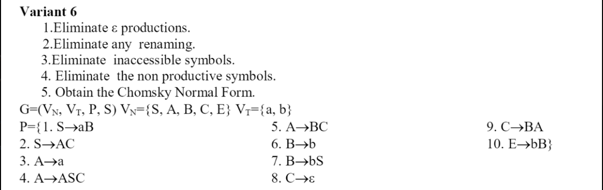

# Topic: Chomsky Normal Form
## Course: Formal Languages & Finite Automata
### Author: Cernetchi Maxim
### Task

## Theory
<p>
Chomsky Normal Form (CNF) is a specific representation of context-free grammars (CFGs) that simplifies the parsing process and is particularly useful in various computational linguistics and computer science applications. A context-free grammar consists of a set of variables (non-terminal symbols), a set of terminals (terminal symbols), a start symbol, and a set of productions (rules) that define how variables can be replaced by sequences of terminals and other variables.

A context-free grammar is said to be in Chomsky Normal Form if all its production rules satisfy the following conditions:

A production is of the form A -> BC, where A, B, and C are variables (non-terminal symbols). B and C cannot be the start symbol.

A production is of the form A -> a, where A is a variable and a is a terminal symbol (a single character or symbol).

If the grammar allows generating an empty string (ε), there is a production of the form S -> ε, where S is the start symbol, and it is the only production with S on the right-hand side.

CNF has some useful properties:

Simplification: CFGs in CNF have a simplified structure, making parsing algorithms more efficient and easier to implement.

Binary branching: In CNF, each production rule has at most two variables on the right-hand side, which ensures binary branching. This structure simplifies the implementation of parsing algorithms, such as the CYK algorithm and Earley parser.

Elimination of ε-productions, unit productions, and useless symbols: The conversion process to CNF includes the removal of ε-productions (productions that generate empty strings), unit productions (productions with a single variable on the right-hand side), and useless symbols (symbols that do not contribute to generating terminal strings).

Unique parse trees: CNF ensures that there is only one parse tree for each valid string generated by the grammar, which simplifies the process of determining the structure of the parsed sentence.

Every context-free grammar can be transformed into an equivalent grammar in Chomsky Normal Form. The conversion process typically involves several steps, such as removing ε-productions, unit productions, and useless symbols, and converting production rules to the specific forms allowed in CNF.
</p>

## Steps of converting CFG to CNF
To convert a context-free grammar (CFG) to Chomsky Normal Form (CNF), follow these steps:

1. Remove ε-productions: Replace nullable variables in other productions and remove ε-productions.
2. Remove unit productions: Replace unit productions with equivalent non-unit productions.
3. Remove useless symbols: Eliminate unreachable and nonproductive symbols.
4. Convert remaining productions: Replace terminals in mixed productions with new variables, and break long productions into binary productions using new variables.

## Objectives:
1. Learn about Chomsky Normal Form (CNF) [1].
2. Get familiar with the approaches of normalizing a grammar.
3. Implement a method for normalizing an input grammar by the rules of CNF.
    1. The implementation needs to be encapsulated in a method with an appropriate signature (also ideally in an appropriate class/type).
    2. The implemented functionality needs executed and tested.
    3. A BONUS point will be given for the student who will have unit tests that validate the functionality of the project.
    4. Also, another BONUS point would be given if the student will make the aforementioned function to accept any grammar, not only the one from the student's variant.

## Implementation description
There is an all-purpose class Converter which converts every given CFG to CNF. Here is short description for each method used:

**remove_inaccessible_symbols:** Eliminates variables and productions that cannot be reached from the start symbol. This helps simplify the grammar by removing unused variables and productions.

**remove_epsilon_productions:** Removes ε-productions (productions that generate an empty string) by replacing nullable variables in other productions and updating the grammar accordingly. This step is necessary to convert the grammar into CNF.

**remove_nonproductive_symbols:** Removes nonproductive variables and their productions. Nonproductive variables are those that cannot generate terminal strings. This step simplifies the grammar by removing variables that do not contribute to valid derivations.

**remove_unit_productions:** Eliminates unit productions (productions with a single variable on the right side) by replacing them with equivalent non-unit productions. This step ensures that the grammar only contains CNF-compliant productions.

**to_cnf:** Converts the remaining productions to Chomsky Normal Form by replacing terminals in mixed productions with new variables and breaking long productions into binary productions using new variables. This step transforms the grammar into its final CNF representation.

**cfg_to_cnf:** Executes the transformation process by calling the aforementioned methods in the appropriate order, converting the original CFG into CNF.

**print_cnf_productions**: Prints the resulting CNF grammar's variables, terminals, and productions in a human-readable format.

Further explanation for written code is provided in the file itself in the form of comments.
## Unit tests
**unittest** is a built-in Python library used for writing and executing unit tests. It provides a testing framework that allows developers to create test cases, automate test execution, and report test results. Unit tests are essential for ensuring that your code behaves as expected and maintains stability as you make changes to your application.

For the given requirement I wrote one test for each method.
There is an example for one of the methods:
```
    def test_remove_epsilon_productions(self):
        # Set up test data
        variables = {"S", "A", "B", "D", 'C'}
        terminals = {"a", "b"}
        productions = [("S", "a"), ("S", "aD"), ("D", "aD"), ("S", "aA"), ("S", "B"),
                       ("A", "aBB"), ("A", "ε"), ("B", "Aa"), ("B", "b"), ("C", "aC")]
        C = Converter(variables, terminals, productions)

        # Call remove_epsilon_productions
        new_variables, new_terminals, new_productions = C.remove_epsilon_productions(C.variables, C.terminals,
                                                                                     C.productions)
        # Define expected result
        expected_productions = [('S', 'a'), ('S', 'aD'), ('D', 'aD'), ('S', 'aA'), ('S', 'B'), ('A', 'aBB'),
                                ('B', 'Aa'), ('B', 'a'), ('B', 'b'), ('C', 'aC')]

        # Check if the new productions are equal to the expected result
        self.assertCountEqual(new_productions, expected_productions)
```
There is a unit test for the method of removing the null productions. It receives the grammar in certain current form, and also the expected output after executing the method. 
Then there is checked the obtained output with expected. This procedure is repeated for all the tests of methods.

## Conclusion
In conclusion, this work demonstrates the process of implementing and testing a Python program to convert context-free grammars (CFGs) into Chomsky Normal Form (CNF). The Converter class provides various methods to perform the necessary steps of this transformation, such as removing epsilon productions, unit productions, inaccessible symbols, and nonproductive symbols. These methods are then tested using the unittest framework to ensure their correctness and validate the expected outcomes.
## References:
[1] [Chomsky Normal Form Wiki](https://en.wikipedia.org/wiki/Chomsky_normal_form)
